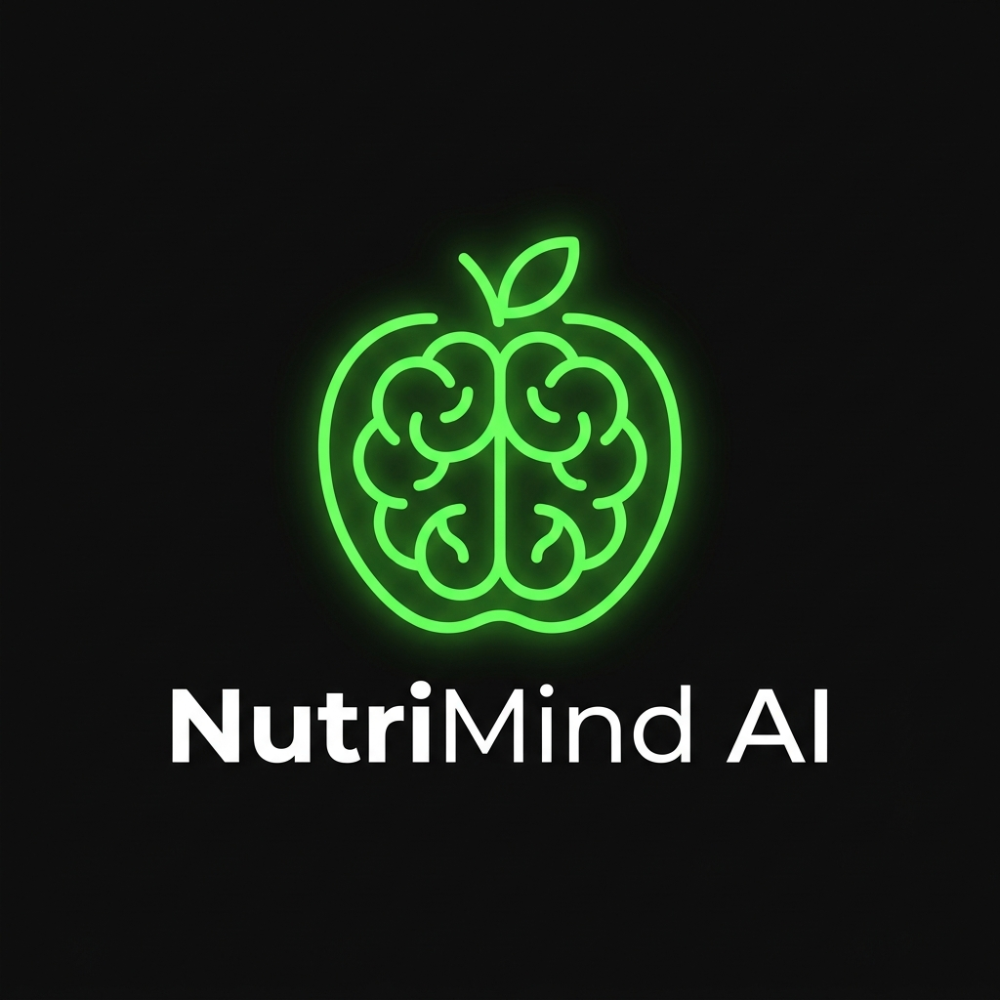

# 🧠 NutriMind AI
### Smart Food & Health Habit Intelligence System

NutriMind AI is a production-grade, offline-first PWA designed to transform health tracking into an intelligent, effortless experience. Built with a focus on **Premium UI/UX**, it features glassmorphism aesthetics, real-time AI coaching, and zero-API-key privacy.



## 🚀 Core Features
- **✨ Intelligent Health Score:** Real-time calculation based on macro adherence, consistency, and physical activity.
- **🎙️ Smart Voice Logging:** Log your meals naturally (e.g., "I ate 2 dosa and an egg") using high-accuracy Web Speech API.
- **📸 Smart Scan:** AI-powered food recognition with confidence scoring and macro breakdown.
- **🤖 AI Health Coach:** Rule-based conversational intelligence providing contextual health advice.
- **📈 Advanced Insights:** Weekly trends, step comparisons, and gamified badge system.
- **🎯 Goal-Driven:** Dynamic macro targets for Fat Loss, Muscle Gain, or Maintenance.
- **📴 Offline-First:** Fully functional PWA that works without an internet connection.

## 🛠️ Tech Stack
- **Frontend:** React + Vite + Tailwind CSS
- **Animations:** Framer Motion
- **State:** Zustand (Persistent)
- **Icons:** Lucide React
- **PWA:** Vite PWA Plugin
- **Testing:** Vitest + React Testing Library

## 📦 Installation & Setup

```bash
# Clone the repository
git clone https://github.com/jeevanL16/nutrimind-ai.git

# Install dependencies (requires --legacy-peer-deps for Vite 8 compat)
npm install --legacy-peer-deps

# Run development server
npm run dev
```

## 🧪 Testing
```bash
# Run unit tests
npm run test
```

## 🎨 Design Philosophy
NutriMind AI uses an **Ultra-Dark Glassmorphism** design system:
- **Background:** Radial gradients (#111111 to #050505)
- **Cards:** `backdrop-blur-2xl` with subtle `white/0.05` borders
- **Accents:** Neon Green (#00FF87) and Deep Purple (#7C3AED)

## ⚖️ License
MIT License - Created for the Hackathon Evaluation.
